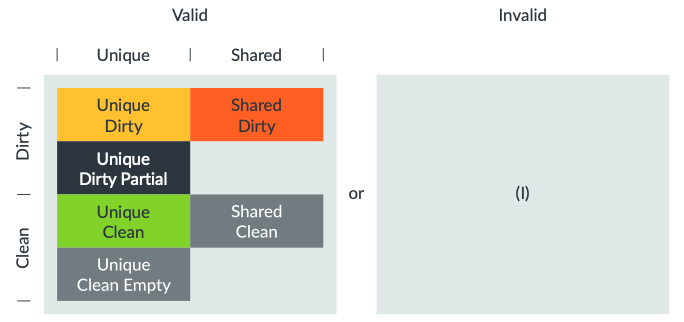

## CHI Cache Line State Terms
- Invalid: The cache line does not exist in the local cache.
- Valid: The cache line exists in the local cache.
  - Unique: The cache line exists only in the local cache of one requester and not in the local cache of other requesters.
  - Shared: The cache line may exist in the local cache of other requesters.
  - Clean: The local cache is not responsible for updating the cache line copy in the main memory. A clean cache line state does not necessarily mean that it matches the value in the main memory. If another requester that had a cache line in the unique state updates the copy, and the requester snoops the cache line copy, it may have a cache line copy that is in a clean state but has a different value from the main memory.
  - Dirty: The cache line copy has changed value relative to the main memory. When a requester with a dirty state copy evicts the copy from the local cache, the requester must either (1) update the dirty copy in the main memory or (2) transfer the dirty responsibility to another component (another requester or HN).
  - Partial: Some data bytes (none - all) are valid in the local cache. This can occur when the requester updates the copy in the UCE state. When snoop or evict is performed, a response including data must be sent to the HN so that the HN can merge data for the full cache line size.
  - Empty: The requester has ownership (the right to store) of a specific cache line, but the data in the cache line is not valid. If the requester is going to write to the full cache line, the Unique Clean Empty state is sufficient. This is used because it can save interconnect bandwidth by preventing unnecessary data transmission.

## CHI Cache Line States

- Invalid: The cache line does not exist in the local cache.
- Unique Dirty: The cache line exists only in the cache that has the copy, and the copy was updated from the value in main memory. When snooped, the cache line copy must be delivered to the requester.
- Unique Dirty Partial: Same as Unique Dirty, the requester can update its cached copy, but only some bytes are valid. Therefore, when snooped, the copy must be delivered to the HN (not the original requester) so that the HN can return the merged data to the original requester.
- Shared Dirty: The copy was updated from the value in main memory, and this cache is responsible for updating the main memory. Since it is a shared state, copies may exist in other caches. If the Shared copy exists in other caches, those copies must be Shared Clean.
- Unique Clean: The copy exists only in one local cache, and it matches the value in main memory. The requester can modify the copy without notifying other caches.
- Unique Clean Empty: Same as Unique Clean in that the copy exists in only one local cache, but none of the bytes are valid. When snooped, the copy value should not be passed to HN or the original requester (snooper).
- Shared Clean: The cache line is stored in one or more local caches. It may or may not be the same value as the main memory. It is not responsible for writing the copy to the main memory when an eviction occurs.

## CHI Nodes
CHI components can be classified into the following nodes.
- RN: Node that generates transactions such as read and write.
  - RN-F (Fully Coherent Request Nodes): Has a coherent cache and responds to snoop.
  - RN-I (I/O Coherent Request Nodes): Has a coherent cache and does not respond to snoop. This refers to cases where there is no cache of its own, such as a manager using ACE-Lite.
  - RN-D (I/O Coherent Request Node with DVM support): Same as RN-I, but can receive DVM messages.
- HN: Handles request ordering, creates transactions in SN, issues snoop transactions, and handles DVM operations.
  - HN-F (Fully Coherent Home Nodes): Determines ordering for coherent memory and creates snoop transactions for RN-F.
  - HN-I (Non-coherent Home Nodes): Determines ordering for requests to the I/O subsystem.
  - MN (Miscellaneous Nodes): Handles DVM transactions sent by RN. Sometimes implemented as HN-D nodes.
- SN: Normal memory or peripheral memory.
  - SN-F: Node used in memory devices that support coherent memory space. For example, a memory controller can be connected to an SN-F node.
  - SN-I: Node used in devices that have non-coherent memory or I/O peripheral areas.

Some components can be classified as requesters or completers.
- Requester: A component that initiates a transaction by issuing a request message. A requester can be (1) a component that initiates a transaction independently, or (2) an interconnect that issues a transaction independently or as a side-effect of another transaction.
- Completer: A component that responds to a transaction received from another component. A completer can be (1) an interconnect such as HN or MN, or (2) a subordinate outside the interconnect.

## Node Channels
RN-F has the following six channels:
- REQ(TXREQ): Outbound request. Used to send requests such as read, write, cache maintenance operation, and DVM request.
- WDAT(TXDAT): Outbound data. Used to send write data, atomic data, snoop data, and forward data.
- SRSP(TXRSP): Outbound response. Used to send snoop response, completion acknowledge.
- SNP(RXSNP): Inbound snoop request. Used to receive snoop transaction, DVM operation.
- RDAT(RXDAT): Inbound data. Used to receive read data, atomic data.
- CRSP(RXRSP): Inbound response. Used to receive response from completer.

The following constraints apply to the SNP channel.
- Only HN-F and MN can send messages to the SNP channel.
- Only RN-F can accept snoop on the SNP channel.
- Only MN can accept DVM message snoop on SNP channel.

## Source
Arm®, Learn the architecture - Introducing AMBA CHI user guide, 2024